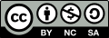

# frankenstein.lang (version 0.2)

Este proyecto, es un intento de crear una especie de _"piedra roseta"_ para los lenguajes de programación. Esto, no quiere decir que sabiendo un lenguaje X, vamos automáticamente a saber programar en el lenguaje Y. ¡No! ¡Esto no funciona así!

Los objetivos del proyecto **frankenstein.lang** son:
1. **Establecer definiciones no ambiguas** de los términos asociados a los lenguajes de programación (en la medida de lo posible) que nos permitan unificar la visión que tenemos de los mismos.
1. **Identificar similitudes y diferencias** entre el lenguaje de programación X y el lenguaje Y. Esto nos da una visión panorámica de un lenguaje antes de aprenderlo.
1. **Mejorar la comunicación** entre un programador del lenguaje X y otro del lenguaje Y. Con esto reducimos los tiempos de resolución de las discusiones/debates.
1. **Identificar que aspectos** del lenguaje X son más **difíciles de entender** por la propia comunidad X o por los nuevos aprendices.

# Contenidos

1. [Licencia](LICENSE.md)
1. [Prólogo](docs/prologo.md)
1. [El origen](docs/origen.md)
1. [Antecedentes](docs/antecedentes.md)
1. [Descripción](docs/descripcion.md)
1. [Objetivos](docs/objetivos.md)
1. [La técnica fenicia](docs/tecnica-fenicia.md)
1. [El paradigma de Frankenstein](docs/paradigma-frankenstein.md)
1. [La unidad de medida SOFA](docs/sofa.md)
1. [Conclusiones](docs/conclusiones.md)
1. [El futuro](docs/futuro.md)

# Contacto

* Email: dvarrui@protonmail.com
